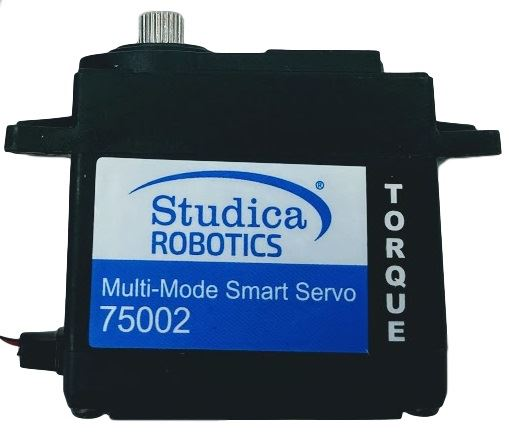
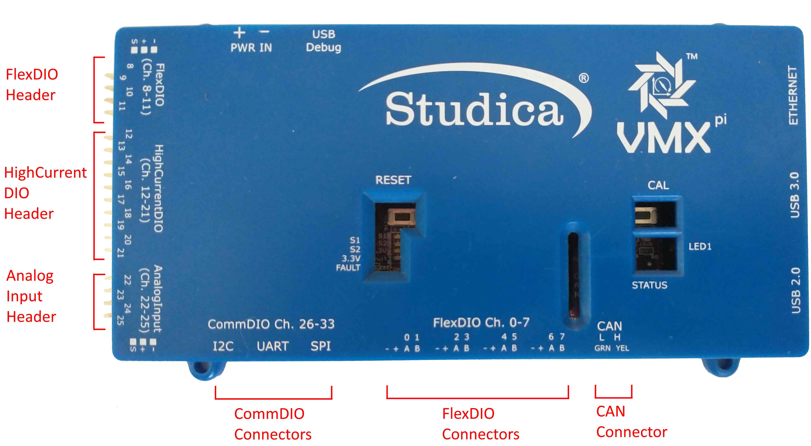
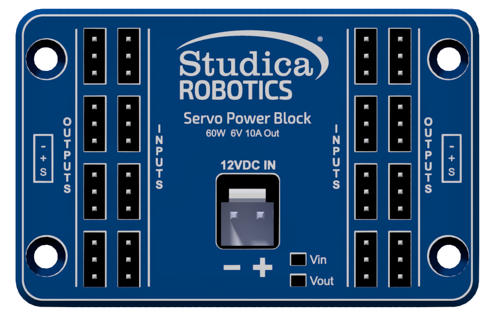

# Introduction
The kit has a Multi-Mode Smart Servo included. The multi-mode servo allows for continuous and standard operation of the servo motor. In continuous mode, the servo will spin proportionally based on input in the CW or CCW direction. The max speed the servo will spin is 50rpm. In standard mode, the servo will act as a regular servo and have a range of motion of 300°. That is 150° CW and 150° CCW.

# Conecting the servo

## VMX Controller connection
In the left side of the VMX Controller we have 3 types of pins.
* FlexDIO
* HightCurrentDIO
* Analog Input

Our servo will be conected in one of the `HightCurrentDIO` headers. The `header id` starts from `0` to `9`, if you connect your servo in the first pin your servo port or id will be `0`. 


## Servo power block connection
We have the `Servo power block`, we need to connect the wire from the `VMX Controller` to one of the `input` headers in the `Servo power block` and then connect the `servo` to the `output` header


# Creating a basic servo control
## Standard servo motion
```java
//import the Servo Library
import com.studica.frc.Servo;

//Create the Servo Object
private Servo servo;

//Constuct a new instance
servo = new Servo(port);

//Can then use this mutator to set the servo angle
servo.setAngle(degrees); //Range 0° - 300°  
```
> The mutator method will allow you to set the angle of the servo

## Continuous Servo
```java
//import the Servo Continuous Library
import com.studica.frc.ServoContinous;

//Create the Servo Continuous Object
private ServoContinous servo;

//Constuct a new instance
servo = new ServoContinuous(port);

//Can then use this mutator to set the servo speed
servo.set(speed); //Range -1 - 1 (0 Stop)
```
> The mutator method will allow you to set the speed of the servo